<picture>
  <source media="(prefers-color-scheme: dark)" srcset="./assets/ved-banner-dark.svg">
  <source media="(prefers-color-scheme: light)" srcset="./assets/ved-banner-light.svg">
  
</picture>

 

 

**AI Engineering**

**Frontend & Product**

**Backend, Data & Cloud**

<picture>
  <source media="(prefers-color-scheme: dark)" srcset="https://raw.githubusercontent.com/ved-sharma-2411/ved-sharma-2411/output/github-snake-cyber.svg">
  <source media="(prefers-color-scheme: light)" srcset="https://raw.githubusercontent.com/ved-sharma-2411/ved-sharma-2411/output/github-snake-ocean.svg">
  
</picture>

<!--   

 -->

